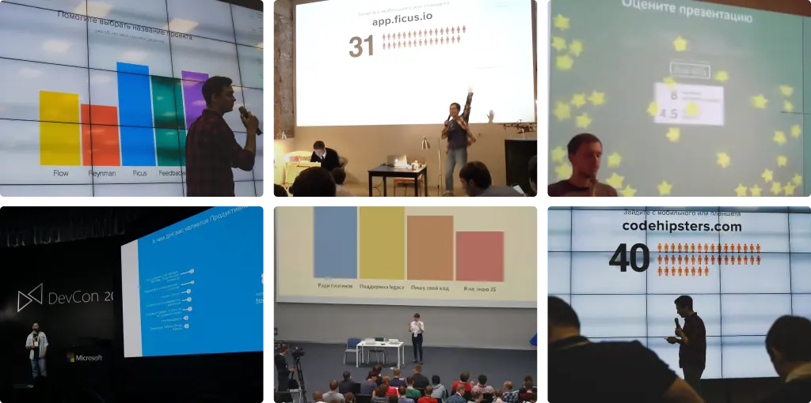

# ficus.io

Ficus **was** an app for creating online presentations with interactive real-time slides, such as
polls, comments, and ratings. It was built in 2014, but it is currently discontinued.



## Embeddable Ficus polls

The web app isn't available anymore, however you are free to use embeddable components in your code:

```js
// import ESM directly from ficus.io CDN
import { createPoll } from "https://ficus.io/widget.js";

const [update, unmount] = createPoll(rootElement, {
  config: {
    question: "Yes or No?",

     // optional, where the poll is being presented
    url: "ficus.io",

    answers: [
      { id: "n", color: "red", label: "NO!" },
      { id: "y", color: "blue", label: "YES!" },
    ],
  },

  // optional, you can use `update` to populate the poll new the new responces later on
  votes: [
    { id: "1", answer: "y" },
    { id: "1", answers: ["n", "y"] }, // multiple answers per response are allowed!
  ],
});

// update the poll with the new responses
update({ votes: [...] })

// destroy the widget when you're done
umount()
```

## Configuration & Theming

Poll configuration is flexible and supports both short and verbose forms. See examples below:

```js
createPoll(el, {
  config: {
    question: "Cats or dogs?",
    answers: ["Cats!", "Dogs!"], // ficus will assign ids ('0' and '1') and colors automatically
  },
});

update({ votes: ["0", "0", "1"] }); // two votes for 'Cats' and one for 'Dogs'
```

Fonts and colors are also customizable:

```js
createPoll(el, {
  config: { ... },

  // override default theme settings (every prop is optional here)
  theme: {
    font: 'Comic Sans MS',   // default: system-ui
    backgroundColor: 'blue', // default: white
    textColor: 'red',        // default: black

    // default: 4:3
    // Ficus will automatically resize the poll to fill the parent container's width
    aspectRatio: '16:9'
  }
});
```

## Credits

Built by the former members of Code Hipsters: Eugene, Sam, Tikhon, Alexey, Victor and Boris.
